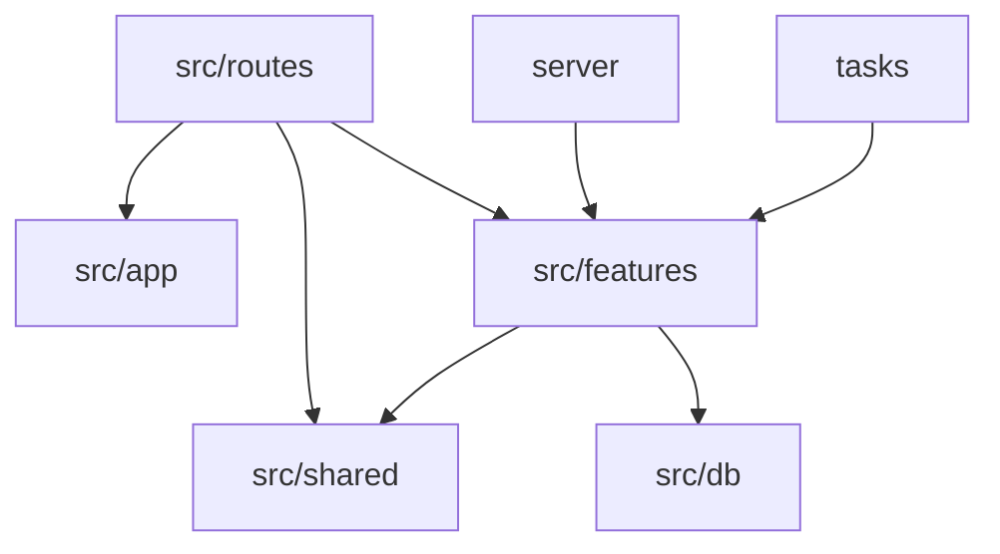

# Enterprise File Structure

This codebase is organized as a single-package modular monolith. TanStack Start,
Nitro, Drizzle, and deployment tooling remain in one deployable unit, while
product behavior is owned by explicit domain modules.

## Top-Level Ownership

```text
src/
  app/        Application shell, router wiring, layouts, providers, global CSS.
  routes/     TanStack file routes and thin API adapters.
  features/   Domain-owned UI, data access, server logic, contracts, and tests.
  shared/     Cross-domain primitives with no product ownership.
  db/         Drizzle client and schema entry point.
server/       Nitro process lifecycle, plugins, and runtime worker wiring.
tasks/        Nitro scheduled task entry points.
scripts/      Operational scripts and local tooling.
infra/        Terraform and deployment infrastructure.
drizzle/      Generated Drizzle migrations.
```

## Dependency Direction

Route files may import from `src/app`, `src/features`, and `src/shared`, but
should not contain product logic. Feature modules may import shared primitives
and database schema, but should not import from another feature unless the
dependency is a deliberate public contract. Shared modules must stay independent
of feature modules.



## Feature Module Shape

Each product domain follows the same shape when the folder is needed:

```text
src/features/<domain>/
  ui/          React components and route page bodies owned by the domain.
  data/        query options, mutations, client data helpers, and server fns.
  server/      server-only business logic, repositories, and integrations.
  contracts/   request/response schemas, persisted DTOs, and route contracts.
  types.ts     domain-level public types.
  index.ts     intentional public exports only.
```

Tests stay next to the behavior they cover. Cross-route or external-service
contract tests may live in a dedicated integration test area later, but colocated
feature tests remain the default.

## Boundary Rules

- Keep `src/routes` framework-driven: validate input, call a feature contract or
  server function, return a response.
- Keep `src/app` product-neutral: app layouts, root components, providers, and
  router setup.
- Keep `src/shared` generic: shadcn primitives, AI element primitives, hooks,
  formatting helpers, HTTP errors, durable stream helpers, and shared DTOs.
- Keep persisted database DTOs out of UI modules. If Drizzle schema needs a
  TypeScript shape, define it in a feature `contracts` folder or `src/shared`.
- Keep Nitro process concerns in `server` and scheduled entry points in `tasks`;
  both should delegate business behavior to feature modules.
- Prefer moving a whole domain at once over scattering new helpers into `lib`.

## Migration Standard

When moving a domain, preserve route behavior first, update imports second, and
run the smallest relevant verification before moving to the next domain. Avoid
compatibility shims unless an external API or persisted data shape requires one.
